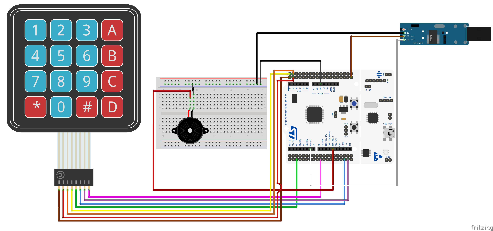
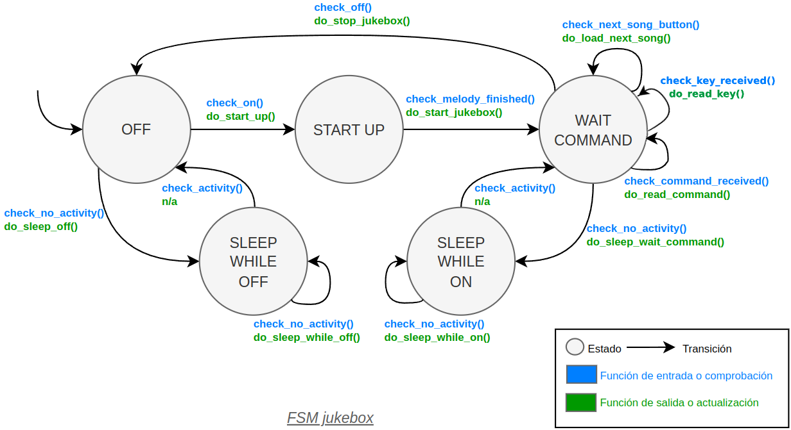

# JUKEBOX PROJECT

## Authors

* **Alumno 1** - github: [David Fuentes Martín](https://github.com/dawfunes)
* **Alumno 2** - github: [Pablo de la Cruz Gómez](https://github.com/Zohard02)

Este proyecto se ha desarrollado para la asignatura de SDG2 de la ETSIT UPM en el Grado en Ingeniería de Tecnologías y Servicios de Telecomunicación. A lo largo del año, se ha desarrollado una jukebox con diferentes funcionalidades separadas en versiones donde las versiones 1-4 son para el desarrollo de las funcionalidades básicas de la jukebox y la versión 5 teniamos libertad para implementar nuevas características.

This project has been developed for the subject SDG2 at ETSIT UPM in the Grado en Ingeniería de Tecnologías y Servicios de Telecomunicación. Over the year, we've developed a jukebox with different functionalities separated in versions where versions 1-4 are for the basic functionalities of the jukebox and version 5 gave us freedom to add new features.

El desarrollo está hecho en un entorno llamado MatrixMCU sobre una placa STM32 Nucleo. Todas las conexiones estan indicadas en el diagrama de abajo.

The development is made in an environment called MatrixMCU with a STM32 Nucleo board. All conections are shown in the diagram below.

Este proyecto demuestra cómo funciona el proyecto Jukebox utilizando una comunicación serial a través del puerto USART con un STM32F446RE conectado a un ordenador. También utiliza un zumbador para reproducir las notas y el botón de usuario para interactuar con el Jukebox.

This project demonstrates how the project Jukebox works using a serial communication via USART port with an STM32F446RE connected to a computer. It also uses a buzzer to play the notes and the user button to interact with the Jukebox.

Click on the image before to watch the Jukebox Demo

## Version 1
In Version 1, we are going to make the system work only by using the user button, which is connected to the PC13. It uses the interrupt EXTI13 to detect when is the button pressed.

| Parameter     | Value                 |
| ------------- | --------------------- |
| Pin           | PC13                  |
| Mode          | Input                 |
| Pull up/down  | No pull no push       |
| EXTI          | EXTI13                |
| ISR           | EXTI15_10_IRQHandler  |
| Priority      | 1                     |
| Subpriority   | 0                     |
| Debounce time | 100-200 ms            |

## Version 2
In Version 2, we are going to add a Serial Coommunication device. We are going to use the USART3 port to receive the commands from the computer.

| Parameter    | Value       |
| ------------ | ----------- |
| Baudrate     | 9600        |
| Data bits    | 8           |
| Stop bits    | 1           |
| Parity       | None        |
| Flow Control | None        |
| Pins         | PB10,PC11   |
| Mode         | Alternative |
| Pull up/down | Pull up     |
| ISR          | USART3_IRQn |
| Priority     | 2           |
| Subpriority  | 0           |

## Version 3
In Version 3, we are going to add a Buzzer. This buzzer will have the following pin to configure **PWM**:

| Parameter    | Value       |
| ------------ | ----------- |
| Pin          | PA6         |
| Mode         | Alternative |
| Pull up/down | No pull     |
| Timer        | TIM3        |
| Channel      | Channel 1   |
| PWM Mode     | PWM Mode 1  |
| Duty Cycle   | 50%         |

To control the duration of each note we are going to use TIM2 and to deal with the interruptions, TIM2_IRQHandler

| Parameter    | Value           |
| ------------ | --------------- |
| Timer        | TIM2            |
| Interrupt    | TIM2_IRQHandler |
| Priority     | 3               |
| Subpriority  | 0               |

## Version 4
In Version 4, we are going to wrap it all up adding a sleep mode and the interaction through the USART using commands to send to the jukebox.

| Command      | Parameter  | Description                           |
| ------------ | ---------- | ------------------------------------- |
| play         | _          | Play current melody                   |
| pause        | _          | Pause melody                          |
| stop         | _          | Stop melody                           |
| next         | _          | Play next melody                      |
| info         | _          | Show information about current melody |
| select       | melody id  | Play song with given id               |
| speed        | speed      | Change player speed                   |

## Version 5
In Version 5 we have done several improvements to the jukebox.
We started by adding several songs, this songs is the new list of songs anf their ids:

| ID  | Song                       |
| --- | -------------------------- |
| 0   | Scale                      |
| 1   | Tetris                     |
| 2   | Happy Birthday             |
| 3   | March of the Toreadors     |
| 4   | Careless Whispers          |
| 5   | Legend of Zelda Main Theme |
| 6   | Imperial March             |
| 7   | Mario Bros Main Theme      |
| 8   | Pokemon Main Theme         |
| 9   | Halloween Theme            |
| 10  | Outro                      |

After that, we created a couple new commands and improved others. We have the ones listed above and:

| Command  | Parameter       | Description                                   |
| -------- | --------------- | --------------------------------------------- |
| info     | melody id       | Show information about the song with given id |
| list     | _               | Prints the list of all songs and IDs          |
| help     | page or command | Prints helpful information about commands     |

We ended up adding more HardWare. We added a 4x4 keypad that can be used to select a certain track. The keypad has 8 outputs this being 4 columns and 4 rows with which we can decode what key has been pressed.

| 1 | 2 | 3 | A | 

| 4 | 5 | 6 | B |

| 7 | 8 | 9 | C |

| * | 0 | # | D |

| Keypad output | Pin  |
| ------------- | ---- |
| Row 0         | PC_0 |
| Row 1         | PC_1 |
| Row 2         | PC_2 |
| Row 3         | PC_3 |
| Column 0      | PC_4 |
| Column 1      | PC_5 |
| Column 2      | PC_6 |
| Column 3      | PC_7 |

(THE COLUMN 3 CAN BE ATTACHED TO EITHER ONE OF THE 2 PARALEL PINS)

We show all this in a small demo:
* Here you can find the **demo of version 5**: [Demo](https://youtu.be/YkYIZ_hYPwY)

Here is the final transitions table of the jukebox for this version since we added a new transition due to the addition of the keypad.

